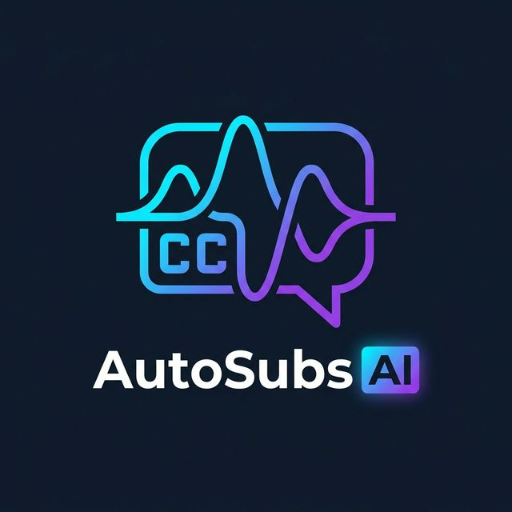
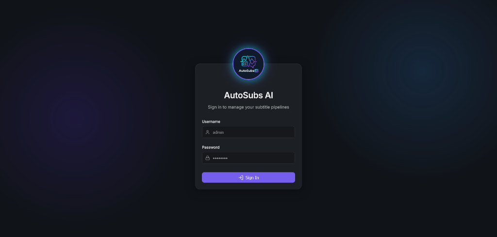
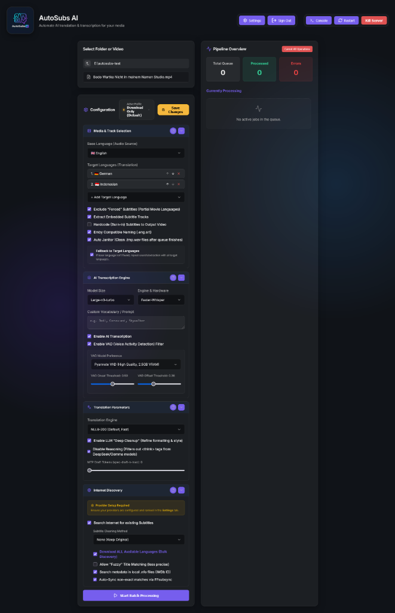
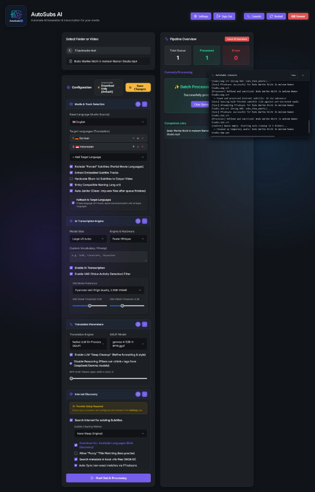
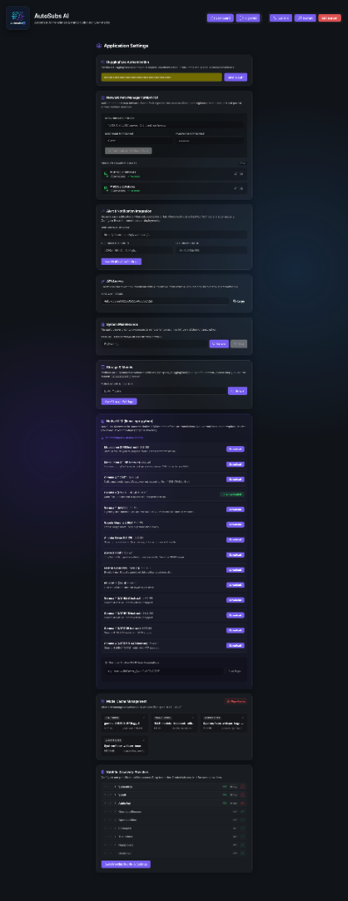

# 🎬 AutoSubs AI

<p align="center">
  
</p>

<p align="center">
  <a href="https://github.com/adromir">
    
  </a>
  
  <a href="https://github.com/adromir/autosubs-ai/releases">
    
  </a>
  
</p>

> [!CAUTION]
> **Work In Progress (WIP)**: This is NOT a stable release. This repository is currently in an Alpha/Experimental state. 
> Only the **ROCm (AMD GPU)** workflow on Windows has been tested so far. Other environments (CUDA, Linux) are currently under development and may be unstable.

<p align="center">
  
  
  
  
</p>

---

**AutoSubs AI** is a state-of-the-art subtitle orchestration pipeline designed for speed, precision, and hardware flexibility. Whether you are running an **AMD RX 9060XT**, an **NVIDIA RTX 4090**, or a **CPU-only server**, AutoSubs AI provides a stunning Glassmorphism GUI to extract, fetch, transcribe, sync, and translate subtitles with zero friction.

---

## 📖 Documentation & Wiki

For in-depth explanations, configuration parameters, and our development roadmap, please visit our **[Official Documentation Site](https://adromir.github.io/autosubs-ai/)**!

- 📚 [Pipeline Overview & Use Cases](https://adromir.github.io/autosubs-ai/)
- 🎯 [Recommended Profiles & Settings](https://adromir.github.io/autosubs-ai/Recommended-Profiles/)
- ⚙️ [Configuration & Parameters Guide](https://adromir.github.io/autosubs-ai/Configuration-and-Parameters/)
- 🤖 [AI Models & Engines Comparison](https://adromir.github.io/autosubs-ai/AI-Models-Comparison/)
- 🗺️ [Development Roadmap & ToDo](https://adromir.github.io/autosubs-ai/Roadmap-and-ToDo/)

---

## 🤔 What is it & Why use it?

Finding the perfect subtitle for a video file is a notorious headache. Sometimes the subtitle is out of sync by seconds, sometimes it's machine-translated gibberish, and sometimes it simply doesn't exist. **AutoSubs AI solves this completely autonomously.**

**Who is this for?**
- 🌍 **Foreign Cinema Enthusiasts**: Love Anime or international cinema? Use our dual-engine LLM translation to convert raw foreign audio into high-quality, localized English subtitles.
- 🍿 **Plex / Jellyfin / Emby Power Users**: Keep your media server pristine. Automatically fetch the best web-subtitles and sync them directly to your video's audio track. No more shifting subtitles mid-movie!
- 🦻 **Accessibility**: Create incredibly accurate closed captions on the fly for uncaptioned videos using industry-standard AI like `WhisperX`.
- 🎥 **Content Creators**: Transcribe your raw footage instantly, generate SRTs, and prepare your content for global audiences.

With a fully automated job queue, you just drag and drop a folder of movies, pick a profile, and walk away. AutoSubs AI handles the rest.

---

## 🚀 Key Features

### 🔒 Secure & Private
- **Zero Cloud Dependence**: Everything runs locally on your hardware. Your files and transcripts never leave your machine.
- **Built-in Security**: Hardened with Token-based Bearer Authentication and a fully secured Login UI, allowing safe deployments on local networks.

### 🔍 Comprehensive Subtitle Discovery
Choose the best source for your media. AutoSubs AI automates the entire search:
*   **Internet Fetching (Subliminal)**: Access subtitle providers (OpenSubtitles, Podnapisi, Addic7ed, etc.) natively through **Subliminal 2.6.0** integration.
*   **Premium Providers**: Built-in high-speed REST clients for **SubSource.net** and **SubDL.com** with automatic **ZIP/Archive extraction**.
*   **Embedded Extraction**: Automatically scans and extracts existing text-based `.srt` tracks from `mkv` or `mp4` containers, avoiding redundant AI work.

### 🧠 Dual-Engine AI Translation
AutoSubs AI features a versatile, high-performance translation pipeline designed for precision and speed:
*   **Premium: Native LLM (GGUF)**: Powered by `llama-cpp-python`, utilizing state-of-the-art models like **Llama 3 (8B)** or **Gemma 2 (9B)** entirely in-process. 
    *   **Context Aware**: Best for capturing nuances, slang, and complex dialogue flow.
    *   **GPU Accelerated**: Full ROCm/HIP and CUDA offloading for lightning-fast inference.
    *   **Zero Dependencies**: Fully self-contained. No external software like Ollama is required.
*   **High-Speed: NLLB-200**: Based on Facebook's *No Language Left Behind* project.
    *   **Maximum Performance**: Optimized for rapid, sentence-level translation across 200+ languages.
    *   **Lightweight**: Minimal VRAM footprint, ideal for background processing while multi-tasking.

### 🔄 Automatic Audio Synchronization
Never deal with "out of sync" subtitles again:
*   **Smart Alignment**: Internet-fetched subtitles are automatically passed to **FFsubsync** to align them perfectly with the video's actual audio track.
*   **Resilient VAD**: Uses the stable `webrtc` voice activity detection engine to ensure alignment succeeds even in loud or musically intense scenes.

### 🎙️ Elite AI Transcription
When no subtitles exist, create your own with industry-leading accuracy:
*   **Whisper Engines**: Full support for `Faster-Whisper` and `WhisperX` (the gold standards of transcription).
*   **SRT Sanitization**: Every subtitle is automatically normalized to `UTF-8` with Unix line endings (`\n`) to ensure 100% downstream stability.

---

## 📸 Screenshots

<p align="center">
  
  
</p>
<p align="center">
  
  
</p>

---

## 🛠️ Installation & Requirements

AutoSubs AI is optimized for high-performance hardware. Please ensure your system meets these prerequisites:

### 📋 Prerequisites

| Hardware | OS | Requirement & Download Links |
| :--- | :--- | :--- |
| **AMD GPU** | **Windows** | **[AMD ROCm 7.1 SDK (HIP SDK)](https://www.amd.com/en/developer/rocm-hub/hip-sdk.html)**<br>**[Visual Studio 2022 C++ Build Tools](https://visualstudio.microsoft.com/visual-cpp-build-tools/)** |
| **AMD GPU** | **Linux** | **ROCm 7.1+ Drivers** (`amdgpu-install`) |
| **NVIDIA GPU** | **Any** | **NVIDIA Drivers (535+)**, **[CUDA Toolkit 13.0](https://developer.nvidia.com/cuda-13-0-0-download-archive)** |
| **General** | **Any** | **Python 3.10+**, **FFmpeg** |

> [!IMPORTANT]
> **Windows ROCm Users**: To compile native LLM support, you MUST install **Visual Studio 2022 Build Tools** with the "Desktop development with C++" workload and have the **ROCm 7.1 SDK** installed. Our installer will handle the rest via the native Clang toolchain.

### 📦 Setup Methods

#### 1️⃣ Native Windows Installation
1. Install the **[AMD ROCm 7.1 SDK](https://www.amd.com/en/developer/rocm-hub/hip-sdk.html)** (or CUDA for NVIDIA).
2. Install **Visual Studio 2022 Build Tools** (Select "Desktop development with C++").
3. Run `install.bat`. It will autodetect your hardware and ask you to create a secure admin account for the Web UI.

#### 2️⃣ Native Linux Installation (Debian/Ubuntu)
**For AMD ROCm (7.1+):**
```bash
# Install the AMDGPU-install tool (Ubuntu 24.04 example)
wget https://repo.radeon.com/amdgpu-install/7.0/ubuntu/noble/amdgpu-install_7.0.60000-1_all.deb
sudo apt install ./amdgpu-install_7.0.60000-1_all.deb
sudo amdgpu-install --usecase=rocm,hiplibsdk,dkms
```

**For NVIDIA CUDA:**
```bash
sudo apt update
sudo apt install nvidia-cuda-toolkit
```
Run `bash install.sh`.

#### 3️⃣ Docker Deployment (Recommended for Servers)
Pre-built Docker containers are automatically published to the GitHub Container Registry (GHCR) via GitHub Actions!

1. **CPU Only**: `docker pull ghcr.io/adromir/autosubs-ai:latest-cpu`
2. **NVIDIA CUDA**: `docker pull ghcr.io/adromir/autosubs-ai:latest-cuda`
3. **AMD ROCm**: `docker pull ghcr.io/adromir/autosubs-ai:latest-rocm`

Alternatively, build and run locally with Compose:
```bash
docker compose --profile cuda up -d --build
```

---

## 💡 Recommendations & Settings

For the best experience, we recommend the following model choices based on your hardware:

### **Transcription (Whisper)**
*   **High Performance (8GB+ VRAM)**: Use `large-v3` or `distil-large-v3`.
*   **Balanced**: Use `medium`. Excellent accuracy with much lower memory footprint.
*   **Fast/CPU**: Use `small` or `base` with `INT8` quantization.

### **Translation**
*   **Native LLM (Premium)**: **Llama-3-8B-Instruct**. Best for capturing nuances, slang, and context-aware translations.
*   **NLLB-200 (Standard)**: `facebook/nllb-200-distilled-600M`. Fast, reliable, and extremely lightweight.

### **Synchronization**
*   **VAD Engine**: Use `webrtc` for general synchronization. It is the most stable choice for background audio processing.

---

## ⚖️ Disclaimer & License

> [!WARNING]
> This software is intended for personal and educational use. Always ensure you have the rights to the content you are processing.

**Creator**: [Adromir](https://github.com/adromir)  
**Webpage**: [https://github.com/adromir](https://github.com/adromir)  
**License**: Distributed under the **MIT License**.

---
*Powered by Deep Learning and a passion for automation.*
